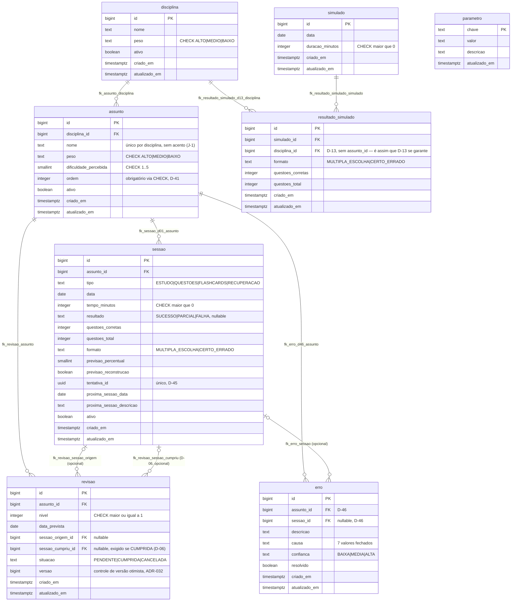

# DIAGRAMA ER

Visualização do schema de banco em Mermaid. **Não define nada** — é espelho
do que já existe nas migrações; a fonte de verdade de coluna, restrição e
índice é sempre `src/main/resources/db/migration/`, documentada por
`docs/SPRINT-1-BANCO.md` e pelos documentos técnicos das sprints que
alteraram o schema depois (`SPRINT-4-ESCADA` — `versao`; `SPRINT-7-METRICAS`
— D-46; `SPRINT-8-SIMULADO` — `simulado`/`resultado_simulado`). Se este
diagrama e o schema real divergirem, o schema real vence, e este arquivo
está desatualizado — não o contrário.

| Campo | Valor |
|---|---|
| Versão | 2.0.0 |
| Data | 2026-08-31 |
| Status | Vigente |
| Subordinado a | `docs/SPRINT-1-BANCO.md`, `docs/SPRINT-4-ESCADA.md` (ADR-032), `docs/SPRINT-7-METRICAS.md` (D-46), `docs/SPRINT-8-SIMULADO.md` (D-13); `src/main/resources/db/migration/V1`, `V3`, `V5`, `V7`, `V8` |

---

## Diagrama

## Notas de leitura

- `parametro` não aparece com nenhuma linha de relacionamento — é
  configuração pura (`01_DOMINIO` §3), sem FK para nenhuma outra tabela.
- `revisao` tem duas FKs distintas para `sessao` (`sessao_origem_id` e
  `sessao_cumpriu_id`): a sessão que gerou a revisão e a sessão que a
  cumpriu não são a mesma pergunta. D-06 amarra a segunda: só pode ficar
  nula se `situacao != 'CUMPRIDA'`.
- Nenhuma tabela tem coluna de fase (D-16). A fase do assunto é derivada em
  memória a partir de `revisao`/`sessao` — não existe aqui porque não deve
  existir. O mesmo vale para `simulado`/`resultado_simulado`: nenhuma FK
  para `assunto` — é assim que D-13 se garante, ausência como garantia
  (`03_INVARIANTES` §9), mesmo mecanismo de D-16.
- `resultado_simulado` é único por `(simulado_id, disciplina_id)` — um
  simulado não tem duas apurações da mesma disciplina. Higiene de dado, sem
  `D-xx` (a restrição não aparece no diagrama, que mostra só FK/PK).
- Todas as **8 tabelas** já existem no schema: as 5 de domínio original
  desde a Sprint 1, `simulado`/`resultado_simulado` desde a Sprint 8. Ganhar
  entidade JPA é progresso de sprint separado: `disciplina`/`assunto` na
  Sprint 2; `sessao` na Sprint 3; `revisao` na Sprint 4; `erro` e
  `Simulado`/`ResultadoSimulado` na Sprint 7/8 (`docs/SPRINT-2-CADASTRO.md`
  §0) — `erro` e `simulado`/`resultado_simulado` tinham a **tabela** desde a
  Sprint 1, só ganharam entidade/service/controller bem depois.
- `fk_erro_assunto` virou `fk_erro_d46_assunto` na Sprint 7 (migração `V7`):
  a restrição já existia desde V1, sem identificador de regra — D-46
  formalizou o que faltava, sem mudar o schema em si.

---

## Changelog

| Versão | Data | Mudança |
|---|---|---|
| 2.0.0 | 2026-08-31 | `simulado`/`resultado_simulado` adicionados (Sprint 8, V8); `revisao.versao` adicionado (ADR-032, V5, esquecido na v1.0.0); `fk_erro_assunto` renomeado para `fk_erro_d46_assunto` (V7); notas de leitura atualizadas para 8 tabelas |
| 1.0.0 | 2026-08-28 | Criado, a partir de `V1__tabelas.sql` e `V3__restricoes.sql` (schema fechado desde a Sprint 1) |
