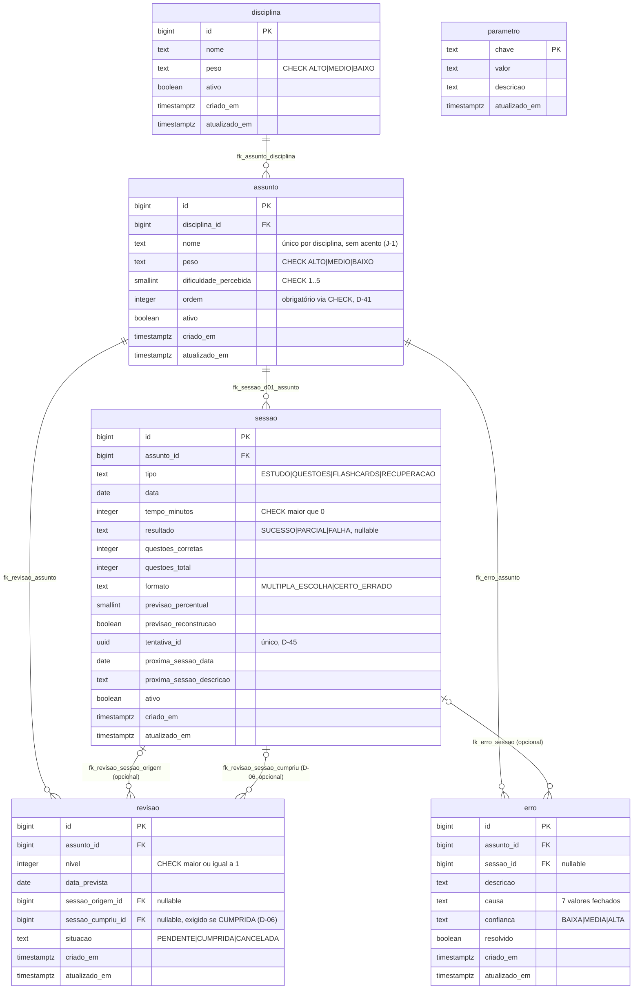

# DIAGRAMA ER

Visualização do schema de banco em Mermaid. **Não define nada** — é espelho
do que já existe nas migrações; a fonte de verdade de coluna, restrição e
índice continua sendo `docs/SPRINT-1-BANCO.md` e os arquivos em
`src/main/resources/db/migration/`. Se este diagrama e o schema real
divergirem, o schema real vence, e este arquivo está desatualizado — não o
contrário.

| Campo | Valor |
|---|---|
| Versão | 1.0.0 |
| Data | 2026-08-28 |
| Status | Vigente |
| Subordinado a | `docs/SPRINT-1-BANCO.md`, `src/main/resources/db/migration/V1__tabelas.sql`, `V3__restricoes.sql` |

---

## Diagrama

## Notas de leitura

- `parametro` não aparece com nenhuma linha de relacionamento — é
  configuração pura (`01_DOMINIO` §3), sem FK para nenhuma outra tabela.
- `revisao` tem duas FKs distintas para `sessao` (`sessao_origem_id` e
  `sessao_cumpriu_id`): a sessão que gerou a revisão e a sessão que a
  cumpriu não são a mesma pergunta. D-06 amarra a segunda: só pode ficar
  nula se `situacao != 'CUMPRIDA'`.
- Nenhuma tabela tem coluna de fase (D-16). A fase do assunto é derivada em
  memória a partir de `revisao`/`sessao` — não existe aqui porque não deve
  existir.
- Todas as 5 tabelas de domínio já existem no schema desde a Sprint 1
  (`PROGRESSO.md` §1). Ganhar entidade JPA é progresso de sprint separado:
  `disciplina`/`assunto` na Sprint 2; `sessao` na Sprint 3; `revisao` na
  Sprint 4; `erro` na Sprint 7 (`docs/SPRINT-2-CADASTRO.md` §0).

---

## Changelog

| Versão | Data | Mudança |
|---|---|---|
| 1.0.0 | 2026-08-28 | Criado, a partir de `V1__tabelas.sql` e `V3__restricoes.sql` (schema fechado desde a Sprint 1) |
